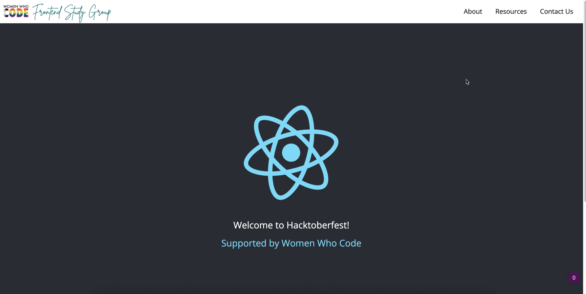
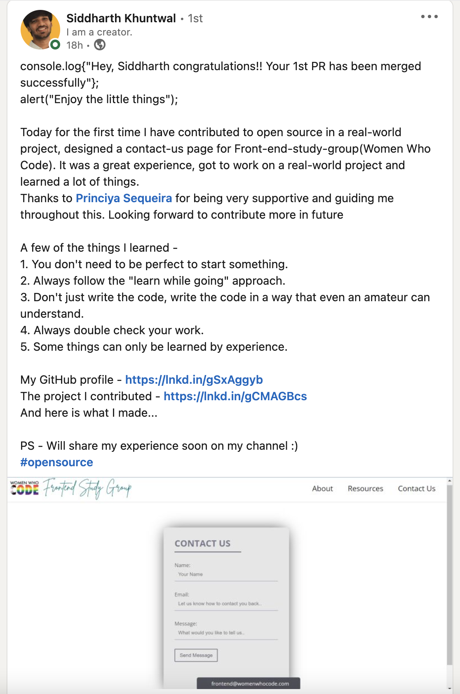
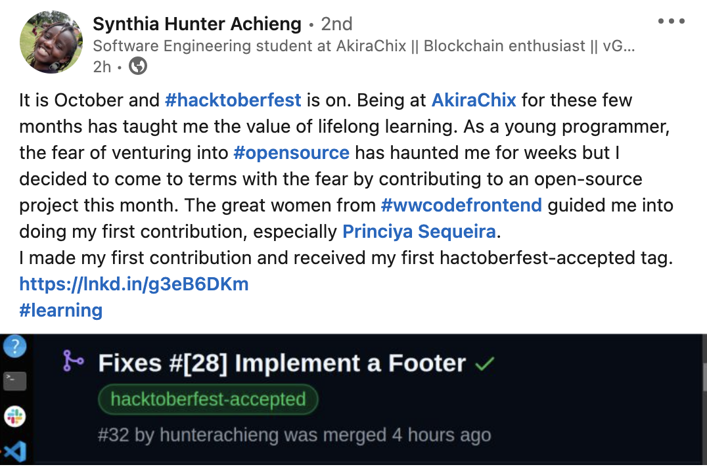
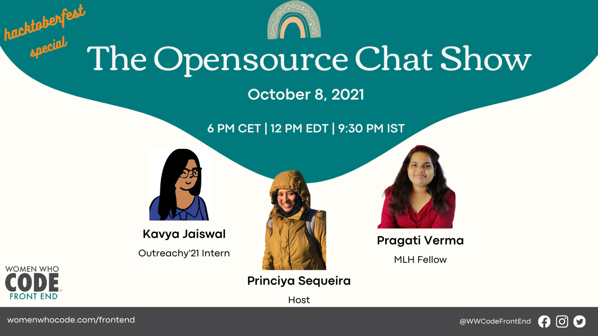

Past meeting notes can be found [here](https://docs.google.com/document/d/1-NoaHmWaCOKel9tpbWLbALOitKLJV8RtwKaX5maMT4g/edit?usp=sharing).

Going forward, I ([Princiya Sequeira](https://princiya.com), Women Who Code Leadership Fellow for Frontend) will publish our weekly updates here in this blog. Before we get started with the updates for the first week of October, here is a quick recap:
- I joined WWCode team as a Leadership Fellow for Frontend on August 23, 2021. Today is Week 8 since I joined the team in part-time capacity.
- My personal goal for this fellowship is to increase the community activity and engagement.

# Week 1: October 1 - 10, 2021

## Opensource study group

- We kicked off the opensource study group for [WWCode Frontend](https://womenwhocode.com/frontend) on October 1, 2021.
- Since then we have had 15 pull requests merged and the community engagement has been great.
- [Here](https://github.com/frontendstudygroup) are the repositories for contributions.

### Study group expectations

Re-iterating the study group expectations which we have also outlined in the [project's readme](https://github.com/frontendstudygroup/frontendstudygroup.github.io#expectations).

- Participation and maintenance of this project is completely voluntary and **we are not committing to teach anything** as part of this effort.
    - If you want to practice together with us, this is a good place!
- We highly encourage you not to use third party UI frameworks. For example, if you want to design a carousel or a tooltip, do it from scratch.
    - However we do understand that sometimes we need to use some third party libraries like redux or react-dom-router. When in doubt discuss it on the issue you are working on.
- Find your own motivation to contribute to this repository and make sure you have the time.
    - Life happens, we get it. Just let us know if you cannot do something you're assigned to and do NOT feel guilty about it.
    - **Things work best for all of us when contribution goals are driven by you**. We as maintainers will only guide you and validate your thought process.
- Be open and honest in your communication.
- Be selfish! Aim to do what you intend to learn and do not feel forced to work on something against your will.

### Study group observations

- Using `position: absolute` seems to be everyone's favorite.
- The problem with CSS is that you can achieve the desired layout without even attempting to learn how CSS works.
- I saw lot of folks resorting to use `position: absolute` and I had to explicitly tell many times why `position: absolute` or `float` css property is not an ideal choice.
- We follow a __"mentee driven approach"__ which we have also highlighted in the above `expectations` section.
- So if you are reading this post and curious to learn why `position: absolute` is not an ideal choice, I strongly suggest to read up on this and then share your learnings as a new blog post to this study group.
- I bet you will be very happy to know that you would have enhanced your CSS skills :).

### Study group testimonials

I have had tears of joy last week when I received a lot of positive words. This definitely makes me bring in more ideas to the study group.

## The opensource chat show - Episode 2

In the [first episode](./how-to-ace-hacktoberfest) we discussed tips on how to make the most out of the hacktoberfest month or through your opensource contributions.

In the 2nd episode we discussed tips about how to pick an opensource project itself, not to be overwhelmed and also learn about opensource licenses.

We had Kavya Jaiswal and Pragati Verma join us and tell us about their opensource adventures.

### Key highlights

- It is important to have a personal goal so that you can narrow down your searches and find a good first project for contribution.
- Opensource is for everyone,don’t restrict yourself.
- Patience is the key, sky is the limit!

### Resources

- [Episode 2 - video recording](https://drive.google.com/file/d/1W2KU0SqYUW34xAnBC5scKckK-J2Bz5Bv/view?usp=sharing)
- Pragati Verma wrote more about opensource licenses in [this blog post](https://dev.to/pragativerma18/how-to-pick-an-open-source-project-to-contribute-to-4kak).
- [Outreachy internship](https://outreachy.org)
- [MLH Fellowship](https://fellowship.mlh.io/)
- [How to ace your outreachy application](https://princiya.com/blog/ace-your-outreachy-application/)

